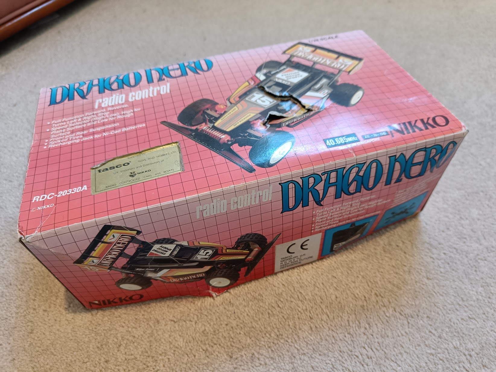
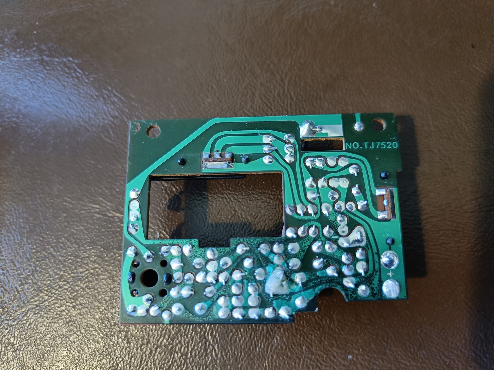
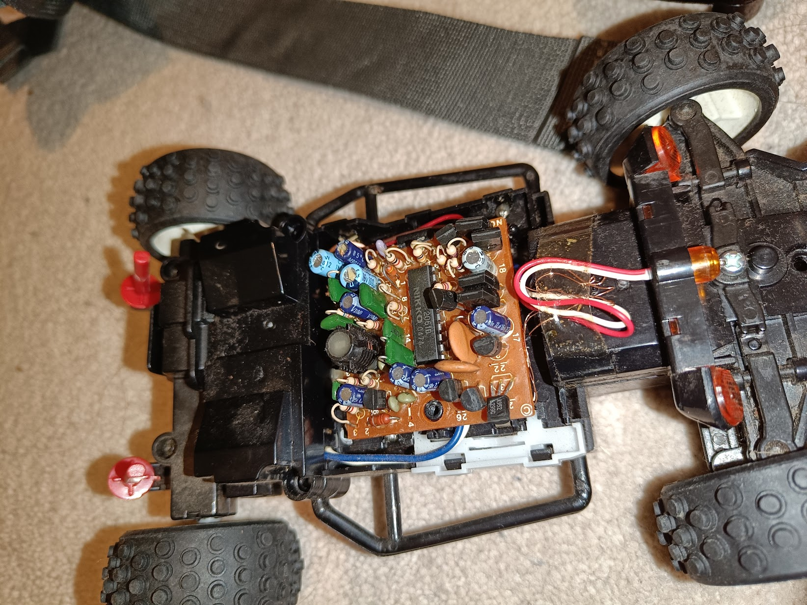
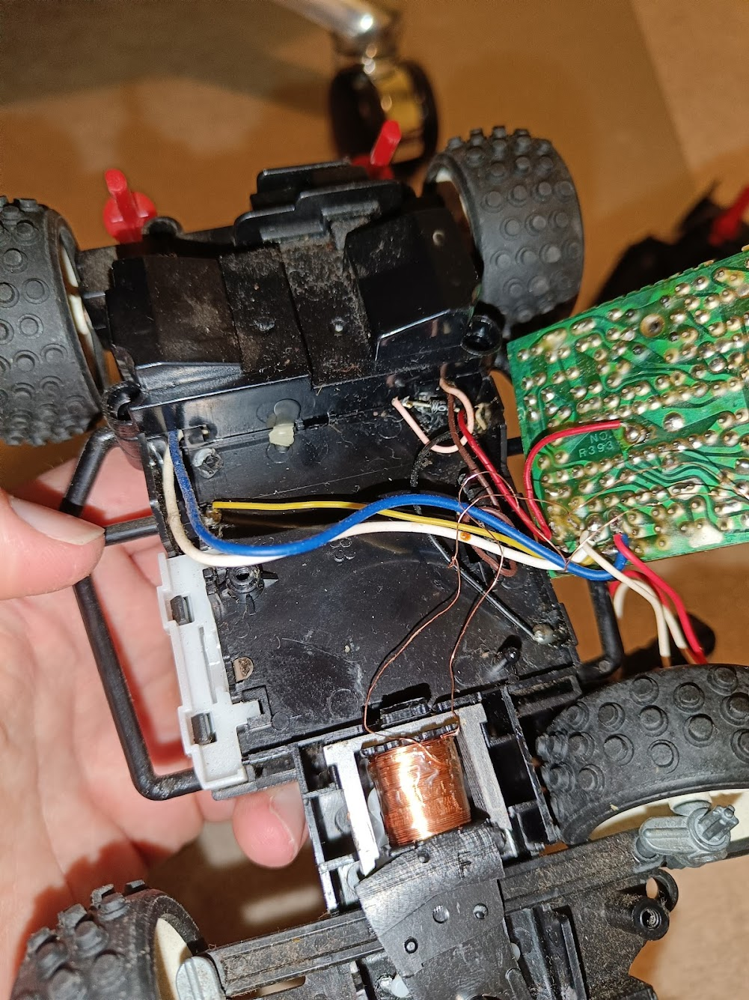
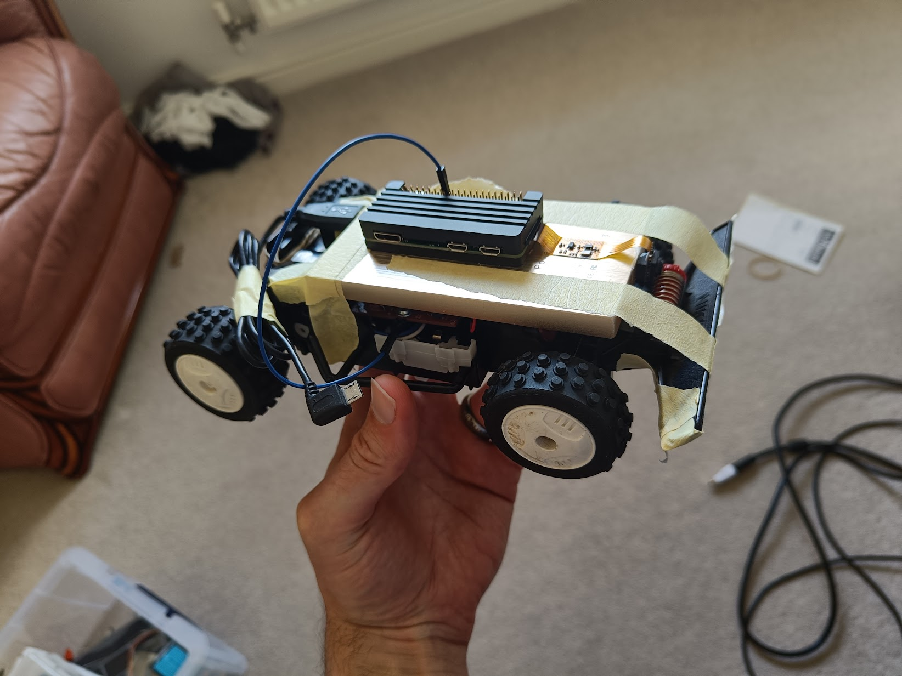
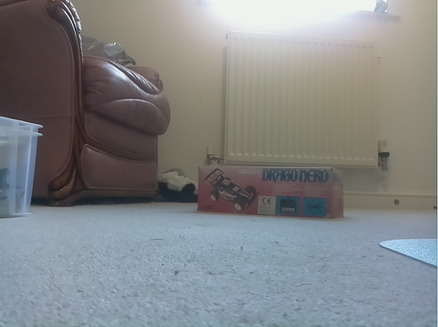
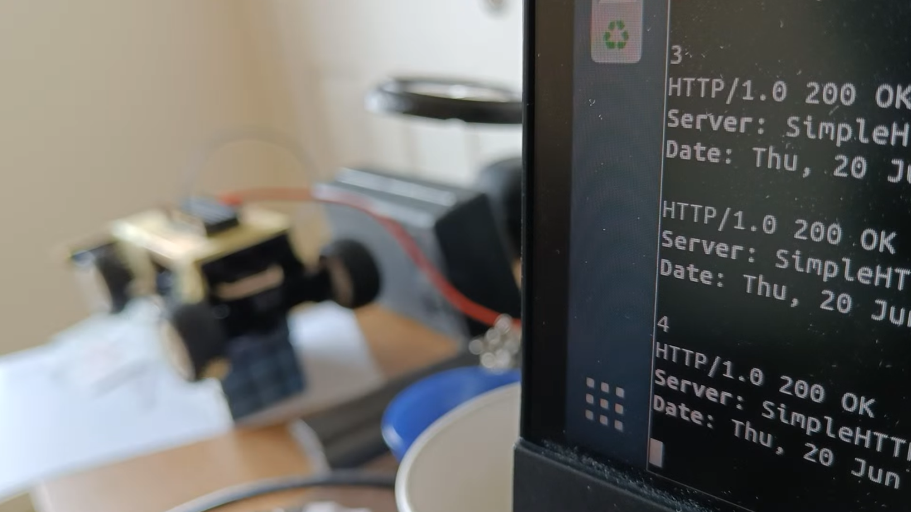
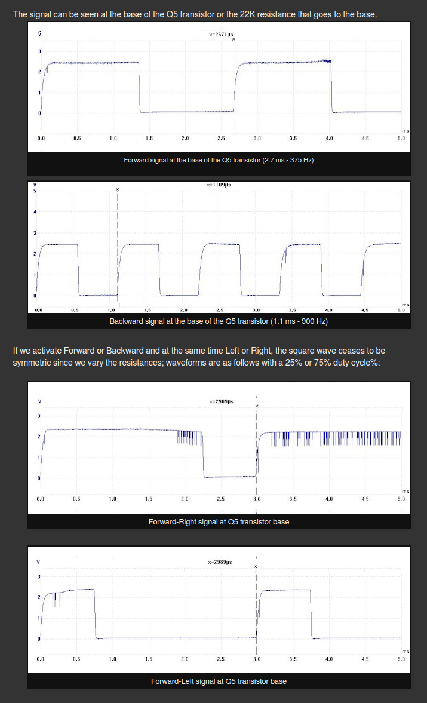
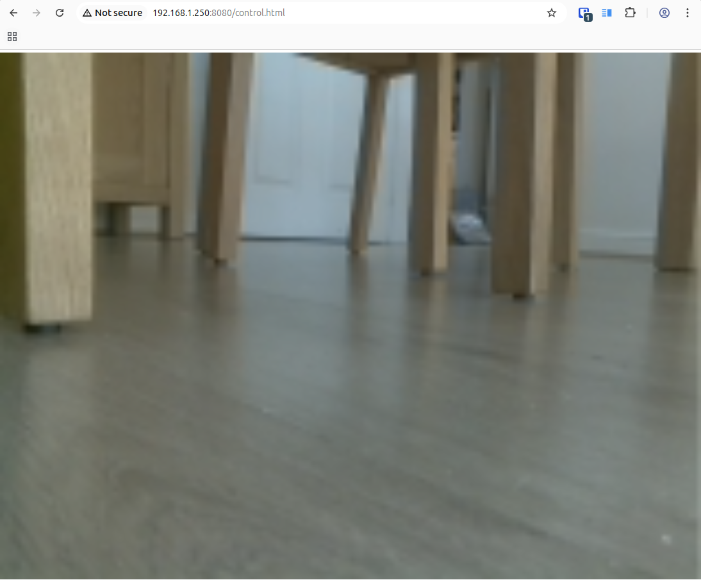

## Wifi Enabling a 90s RC Car (non-destructively)


*Old car box*

I recently found and rescued an old radio controlled car which I had in the early 90s. It seemed in decent condition and I figured my kids could play with it. Sadly, when I got the transmitter out of the box, it had clearly had a 9V battery sat in it for 30 years and the alkaline fluid in it had done a number on the circuit traces.


*Corroded PCB traces*

My first thought was to repair the traces, before I remembered a crucial detail: **I suck at soldering.** I can solder pins into place, but there's a certain artistry about repairing PCB traces that I do not have, aside from the fact that it's not totally obvious where the traces should even *be* in some places. So, requirements:

1. Get car working and controllable
2. Avoid soldering

What to do then? The car itself seemed fine. How can I control the car if I don't have the controller? I noted the part number, `TJ7520`. Maybe someone makes a swap-in replacement for this? No. OK, maybe I can just bypass this whole controller system and put in something else. I've got Raspberry Pi Zero Ws and Teensies cluttering up boxes around my office. The outputs of the receiving circuit were pretty simple.


*Car innards*


*Receiver outputs*

Basically one set of wires to deliver power to the motor in the rear and a couple of tiny wires to control the electromagnet-driven steering in the front. If I took the old receiver out and put a Pi Zero in its place I can easily configure it to power the wheels and steering, plus I could even have variable speed, which the original controller never had.

Thinking about the practicalities however, the Pi needs a decent consistent power source. Although it may well run off the 4xAA power supply that the car has, it's not going to be clean enough when you've also got the same supply feeding a relatively large DC motor. So then I start thinking about swapping out the battery compartment for a USB battery pack, but then that requires the use of a Dremel and maybe I'd ruin it and I used to love this thing. No, can't do that.

OK, what about if the Pi *itself* was the transmitter? Can I turn a Raspberry Pi into an old-school RC controller? I got to Googling and, yes, of course multiple people have already succeeded in doing this. The original controller used a scheme called *Pulse Width Modulation* (PWM) to send specific signals to the car. Fortunately, 10 years ago [someone](https://brskari.wordpress.com/2014/06/02/turn-your-raspberry-pi-into-a-radio-controller-for-rc-vehicles/) had [written the software](http://www.github.com/bskari/pi-rc) to produce RC car signals. I just needed to work out what combination of control messages to use.

So, taking off the original body of the car and taping a USB battery pack and a Raspberry Pi Zero W to it, I then also have the option of attaching a camera on the front for potential first-person view action!


*Slick mod, right? Right?*

Mmm, nice! The only output needed from the Pi is a single GPIO connection direct into the antenna mounting point of the car - no soldering.

### FPV Video

Note the camera mounted on the front of the battery pack? That was the easy part. Turns out that in 2024 the hardest part of getting a Pi Zero camera to work is finding a version of Raspbian old enough to support legacy drivers but new enough that it still has an active `apt` repository. After a lot of frustration attempting to get [mjpg-streamer](https://github.com/jacksonliam/mjpg-streamer) working in the current version of *The OS Previously Known as Raspbian* I settled on Raspbian Buster and it worked easily just like it did when I originally got my [OctoCam](https://shop.pimoroni.com/products/octocam-pi-zero-w-project-kit?variant=41224005898).

Streaming from a Pi Zero would never get you racing drone levels of latency on the video, but making some sacrifices in the MJPG configuration brought the time delay down from seconds to milliseconds:

1. Bring the resolution down. 160x120 is actually surprisingly usable.
2. Reduce JPG quality. I went for 50% and it massively improved lag

The idea is not to get nice pictures but to throw pixels down the wire fast enough that you can just about see what's going on and react quickly enough for it to be driven remotely. Of course, the faster the Pi, the less of a sacrifice you'd need to make.


*View from the car*

### Creating Radio Signals

Then, to work out what pattern of PWM to make the car move, I experimented with [pi-rc](https://github.com/bskari/pi-rc). 


*Fuzzing the control signal with pi-rc*

Immediately I got the car going forwards but then things started behaving erratically. I wasn't getting a consistent reverse or steering for any of the pulse signal combinations. Researching this further, I found [this one blog in Spanish](https://reparar-cochesrc.blogspot.com/2015/12/emisora-nikko-de-6-funciones-y.html) using the TJ7520 board. It turns out that this board doesn't have as sophisticated control scheme as `pi-rc` was designed for. There is no synchronisation pulse followed by a control signal, it's just a constant flow of a single PWM wave for each command. The key part of that blog post was this (Google translated):


*The blog*

Basically this is saying that there is a signal which consists of about 2.7ms pulse and then 2.7ms of silence repeated for forwards which is a cycle of a frequency at about 375Hz and then pulses of 1.1ms each which equates to 900Hz for reverse, then to steer left and right you just vary what proportion of the cycle is pulse and what proportion is silence. That ratio is known as the *Duty Cycle*. A duty cycle of 25% makes the steering turn left, a duty cycle of 75% makes the steering go right. By combining just these two variables - the duty cycle and the pulse cycle frequency you get all of the controls for the car. The controller in that blog post was running at 27MHz, not 40.685MHz as mine was but that shouldn't matter. I then also checked that the other relevant components of the transmitter that were detailed in the blog were the same. The circuit which makes the cycle of pulses is called an [Astable Multivibrator](https://www.electronics-tutorials.ws/waveforms/astable.html). The duty cycle and frequency of the pulses is determined by two capacitors and two resistors. These had the same values as the blog post, that meant that the pulse cycles would be the same in my car.

So now I just need to refactor `pi-rc` a bit so that instead of varying the number of pulses of a fixed duty cycle, it's varying duty cycle and frequency.

Doing some basic maths to convert to what `pi-rc` was expecting resulted in this script:

```bash
#!/bin/bash

# Command line options for duty cycle and frequency
dutycycle=${1:-50} # Default 50%
freq=${2:-380}  # Default 380Hz
repeats=${3:-10} # Optionally vary how many cycles are output
echo "Duty cycle $dutycycle, Frequency $freq"

# Work out how long the burst should be
burst=$(((dutycycle * 10000) / freq))

# Work out how long the silence should be
spacing=$((((100-dutycycle) * 10000) / freq))

echo "repeats: $repeats, spacing: $spacing, burst: $burst"

# Send it as JSON to the pi-rc web API on the car
curl --path-as-is -i -s -k -X $'POST' \
    --data-binary "[{\"frequency\":40.685,\"dead_frequency\":26.995,\"burst_us\":$burst,\"spacing_us\":$spacing,\"repeats\":$repeats}]" \
  $'http://192.168.1.250:8080/command/' > /dev/null

# Wait a little while
sleep 0.2

# Give the car a signal it doesn't understand to make it stop
curl --path-as-is -i -s -k -X $'POST' --data-binary $'[{\"frequency\":27,\"dead_frequency\":49.83,\"burst_us\":1200,\"spacing_us\":400,\"repeats\":4}]' $'http://192.168.1.250:8080/command/' > /dev/null

```

This takes the duty cycle and frequency and turns it into a POST request to `pi-rc`'s JSON API. It worked! I could now use all of the commands!

### A remote control UI

Fortunately, `pi-rc` had a nice web UI already built, but it was running on the assumption that the commands to the car were a sync block followed by a command block, which they weren't. I basically stripped out a bunch of the existing JavaScript and replaced it with the maths in the above bash script to create the right signals, then put an `` on the page which pointed to the `mjpg_streamer` stream URL. Nothing more complex needed as modern browsers will just stream video into an `` element quite happily.

I then have a web app that looks like a full screen video of the view from the car but listens for cursor key presses in order to emulate the fwd/rev/left/right of the car. Works pretty well. There is some expected lag on the video, but not enough to throw off someone who lived through dial-up online gaming.

I set this to run when the pi boots up with a script which starts all the necessary components:

- Video stream
- Pulse generator
- Web UI

```bash
#!/bin/bash
SCRIPT_DIR=$( cd -- "$( dirname -- "${BASH_SOURCE[0]}" )" &> /dev/null && pwd )
echo $SCRIPT_DIR
cd $SCRIPT_DIR
cd  $SCRIPT_DIR/mjpg-streamer/mjpg-streamer-experimental
./mjpg_streamer -i "input_raspicam.so -x 160 -y 120 -fps -quality 10 -vf -hf" -o "output_http.so -w ./www -p 8081" &
cd $SCRIPT_DIR/pi-rc
sudo ./pi_pcm &
python host_files.py &
```

Easiest way to get this to run on boot is with a `@reboot` in the normal user's crontab.

```crontab
@reboot sh $HOME/startup.sh
```

### Testing

The kids thought it was hilarious and chased it around and around the house as I drove it, listening on from upstairs. Then they started to go Robot Wars on it and started pitting it against their various other remote control toys. With a tiny front-facing field of view I stood no chance, getting blind sided at every turn.


*Car-eye view of the dining room at 160x120*

They then tested it out and have done pretty well driving it considering the lag and weird binary steering. It does leave black tyre marks on stuff when it crashes though 😬

### Further Development?

Largely based out of just adding spare components that I've got lying around.

- Car horn
- Lights
- Microphone and/or speaker
- Matrix display for showing messages
- Bumpers so it doesn't leave black tyre marks all over our skirting boards when it crashes.
